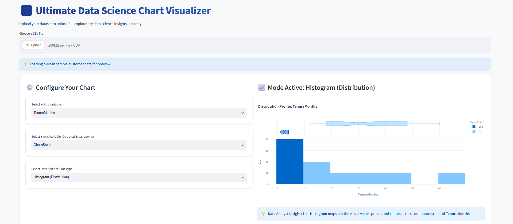

# Ultimate Data Science Chart Visualizer

An interactive, universal Exploratory Data Analysis (EDA) web application built using **Streamlit** and **Plotly Express**. The platform dynamically scans any structured CSV dataset, applies strict data-type validation guardrails, and maps data profiles with dynamic numerical counts and population percentages.

## Live Demonstration
[**Click Here to View the Active Live Application Website**](https://data-science-chart-visualizer-zv3jcxpykungjp997z8mgj.streamlit.app/)

## Application Dashboard Interface Preview

## Advanced Technical Architecture
* **Universal CSV Parser:** Dynamically generates variable configuration parameters using generic data extraction methods (`df.columns.tolist()`).
* **Defensive Error Handling:** Built-in validation architecture filters text inputs out of continuous charts to prevent silent script disruptions.
* **UX Transformation Engines:** Automates processing tasks to map binary values (like `0` and `1`) into transparent corporate labels.
* **Embedded Analytics Framework:** Provides contextual explanations underneath generated charts to accelerate corporate data translation.

## Project Structure
* `app.py` - Core dashboard backend configuration and interface styling engine.
* `requirements.txt` - Complete environment library installation mapping profiles.
* `dashboard_preview.png` - Visual interface architecture capture asset.
